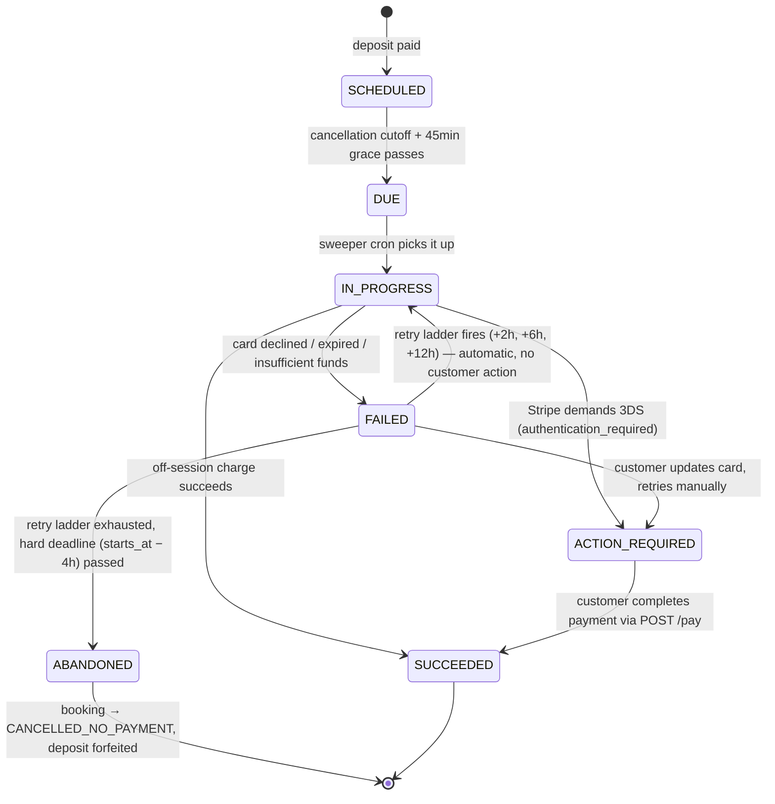
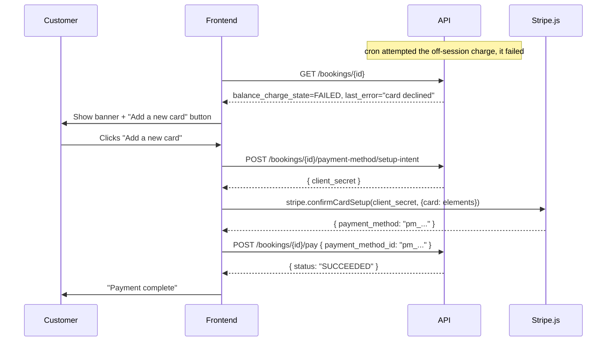
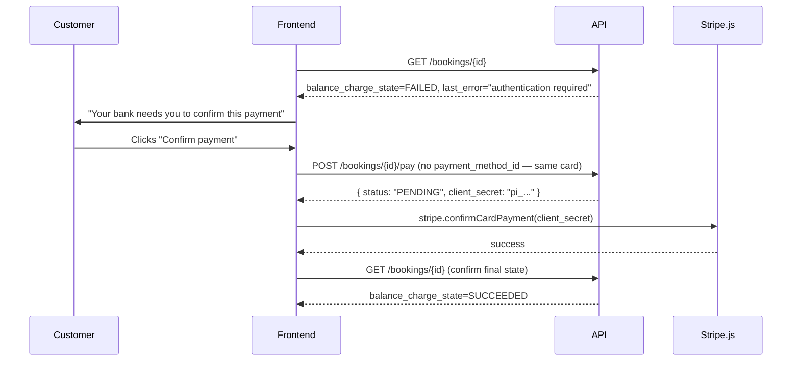

# Remaining Payment (Balance Charge) & Card-Retry — API Contract

> **STATUS: SPEC, NOT YET LIVE.** None of the endpoints below exist in the running API yet. Today the backend only supports creating a booking and paying the *first* charge (deposit or full amount) — see `POST /api/v1/bookings` in [`app/modules/bookings/router.py`](../app/modules/bookings/router.py). The database columns this feature depends on (`balance_charge_state`, `balance_charge_due_at`, `balance_charge_attempts`, `balance_charge_last_error` on `bookings`) already exist and are being written today, but **nothing reads them yet** — there is no cron job that fires the automatic charge, and no `/pay` endpoint.
>
> This document is the intended contract, derived from the team's internal design doc (`planning-docs/payment-booking-plan.md`, "Phase 3"). Build the frontend against it, but expect every endpoint here to 404 until backend Phase 3 ships. Treat this as the thing both sides build to, not a description of production behavior.

---

## 1. Background — why there even is a "remaining payment"

A booking is priced with a `payment_schedule`:

| `payment_schedule`       | What happens at booking time                              |
| ------------------------- | ----------------------------------------------------------- |
| `FULL_UPFRONT`            | Customer pays the full `total` immediately. Nothing left.  |
| `DEPOSIT_THEN_BALANCE`    | Customer pays `deposit_amount` (10% of `total`) now, on-session. The card is saved (`setup_future_usage=off_session`). `balance_amount` is charged **automatically, off-session, no customer action**, shortly after the cancellation cutoff (`starts_at − 24h`), unless it fails. |

Appointments booked ≤24h out are always `FULL_UPFRONT` — there's no time for a deferred balance. Everything below only applies to `DEPOSIT_THEN_BALANCE` bookings.

**The frontend does not initiate the balance charge.** A backend cron sweeps for bookings whose balance is due and charges the saved card server-side. The frontend's job is entirely reactive: show the customer what's happening, and give them a way to fix it if the automatic charge fails.

---

## 2. Balance charge lifecycle



This is exposed to the frontend as `booking.balance_charge_state`, one of:

| Value          | Meaning                                                                 | Frontend should...                                   |
| -------------- | ------------------------------------------------------------------------ | ----------------------------------------------------- |
| `NOT_APPLICABLE` | `FULL_UPFRONT` booking, or balance already resolved.                    | Show nothing.                                          |
| `SCHEDULED`    | Deposit paid, balance will auto-charge later. Everything's fine.        | Optional: "Remaining €X will be charged automatically on \<date\>."     |
| `DUE` / `IN_PROGRESS` | The cron is actively attempting the charge right now.             | Show nothing special; this state is normally too short-lived to catch in a poll. |
| `FAILED`       | The most recent attempt failed. **A retry is still scheduled automatically** unless the ladder is exhausted. | Show a banner: "We couldn't charge your card — we'll retry automatically, or you can pay now." Surface `balance_charge_last_error` (human-readable, already localized server-side). |
| `ABANDONED`    | Retry ladder exhausted before the hard deadline. Booking has moved to `CANCELLED_NO_PAYMENT`. | Show the booking as cancelled; no payment action available. |
| `SUCCEEDED`    | Balance collected. Booking fully paid.                                  | Show as paid.                                          |

**Two distinct failure UX paths**, distinguished by the Stripe error code on the *latest* `BookingPayment` row of `purpose=BALANCE` (see §4 `GET /{id}` response):

- `card_declined`, `expired_card`, `insufficient_funds`, etc. → **"Your card was declined — add a new card to complete payment."** This is the "blocked or expired card" case you described.
- `authentication_required` → **"Your bank requires you to confirm this payment."** Same retry endpoint, but the customer may need to complete a 3D-Secure challenge in-browser (see §5.3).

Both paths converge on the same two endpoints: attach a new payment method (only needed for the decline case) and then retry.

---

## 3. Data contract additions

`GET /api/v1/bookings/{id}` (existing endpoint) needs these fields added to `BookingResponse` — **flag this to backend, the frontend can't build the banner without them**:

```jsonc
{
  "balance_charge_state": "FAILED",           // BalanceChargeState enum, see table above
  "balance_charge_due_at": "2026-09-01T10:00:00Z",
  "balance_charge_attempts": 2,
  "balance_charge_last_error": "Your card was declined.", // localized, null if never failed
  "payment_method": {                          // NEW — card on file, safe-to-display summary only
    "brand": "visa",
    "last4": "4242",
    "exp_month": 3,
    "exp_year": 2026
  }
}
```

`payment_method` is null if no card is on file yet (shouldn't happen for a `DEPOSIT_THEN_BALANCE` booking past the deposit step, but check anyway). This comes from Stripe's `PaymentMethod` object.

**Resolved: cache at webhook time, don't fetch live.** `brand`/`last4`/`exp_month`/`exp_year` should be snapshotted onto the booking (new columns alongside `stripe_payment_method_id`, e.g. `card_brand`, `card_last4`, `card_exp_month`, `card_exp_year`) at the same moment `stripe_payment_method_id` is already captured — `_handle_payment_intent_succeeded` in `app/modules/bookings/payments/service.py:81-83`. This matches the repo's existing convention of snapshotting Stripe data rather than round-tripping to Stripe on every read (same reasoning as the price/rate snapshots on `bookings` itself), and avoids adding Stripe API latency/rate-limit exposure to every `GET /bookings/{id}`. The only other place the card changes is the new §4.2/§4.3 retry-with-new-card flow — refresh the same columns there when a new `payment_method_id` succeeds.

---

## 4. Endpoints

All under the existing `Bookings` tag, `require_roles(CUSTOMER)`, same auth as `GET /api/v1/bookings/{id}`. All responses use the repo's standard envelope (`APIResponse[T]` on success, `{status:"error", data:null, error:{code, message}}` on failure — see `app/core/response.py` / `app/core/exceptions.py`).

### 4.1 `GET /api/v1/bookings/{booking_id}`

*(existing endpoint, extended per §3)* — poll this to render the balance-payment banner. No new endpoint needed for read state.

### 4.2 `POST /api/v1/bookings/{booking_id}/payment-method/setup-intent`

Creates a Stripe `SetupIntent` scoped to the booking's Stripe customer, so the frontend can collect a **new** card without ever touching raw card data.

**Request:** no body.

**Response `200`:**
```json
{
  "status": "success",
  "data": { "client_secret": "seti_..._secret_..." },
  "error": null
}
```

**Frontend flow with this:** pass `client_secret` to Stripe.js / Stripe Elements (`stripe.confirmCardSetup` or the Payment Element) client-side. The customer enters their new card directly into the Stripe-hosted element — **it never touches our backend**. Stripe returns a `payment_method` id (`pm_...`) to the frontend on success. That id is what you pass to §4.3.

**Errors:**
| code | status | when |
|---|---|---|
| `BOOKING_NOT_FOUND` | 404 | not this customer's booking, or doesn't exist |
| `BOOKING_PAYMENT_METHOD_NOT_APPLICABLE` | 409 | booking is `FULL_UPFRONT`, or already fully paid |

### 4.3 `POST /api/v1/bookings/{booking_id}/pay`

Retries the outstanding balance charge (or completes an SCA-blocked one). This is the single endpoint for both failure paths in §2.

**Request:**
```json
{ "payment_method_id": "pm_1AbCDeFgh..." }
```
`payment_method_id` is **optional**:
- Omit it to retry with the card already on file (e.g. after a transient decline the customer wants to just retry, or to complete a 3DS challenge on the existing card).
- Include it (the id returned from §4.2) to switch to a new card and retry with that — this is the "card was blocked/expired, pay with a different card" path.

**Response `200` — charge succeeded immediately:**
```json
{
  "status": "success",
  "data": {
    "purpose": "BALANCE",
    "status": "SUCCEEDED",
    "amount": "144.00",
    "currency": "EUR",
    "client_secret": null
  },
  "error": null
}
```

**Response `200` — needs 3D-Secure confirmation in-browser (`requires_action`):**
```json
{
  "status": "success",
  "data": {
    "purpose": "BALANCE",
    "status": "PENDING",
    "amount": "144.00",
    "currency": "EUR",
    "client_secret": "pi_..._secret_..."
  },
  "error": null
}
```
When `client_secret` is non-null, call `stripe.confirmCardPayment(client_secret)` client-side to complete the 3DS challenge, then re-poll `GET /{id}` (or re-call `POST /pay` with no body) until `balance_charge_state` becomes `SUCCEEDED`.

**Errors:**
| code | status | when |
|---|---|---|
| `BOOKING_NOT_FOUND` | 404 | not this customer's booking |
| `BOOKING_PAYMENT_ALREADY_SUCCEEDED` | 409 | balance already collected — nothing to do |
| `BOOKING_PAYMENT_NOT_DUE` | 409 | booking is `SCHEDULED`/`NOT_APPLICABLE` — nothing is currently owed, don't show the retry UI |
| `BOOKING_CANCELLED` | 409 | booking already moved to `ABANDONED`/`CANCELLED_*` — retry window closed |
| `STRIPE_CARD_DECLINED` | 402 | Stripe declined the retry too — show the same banner again with the fresh error, let them try yet another card |
| `STRIPE_CARD_EXPIRED` | 402 | the `payment_method_id` passed (or the one on file) is expired |
| `VALIDATION_ERROR` | 422 | malformed `payment_method_id` |

**Idempotency:** the frontend does not need to generate an idempotency key — the backend derives one per attempt (`booking:{id}:balance:{attempt_number}`) from the DB. Safe to let the customer double-tap "Pay now"; a second concurrent call while one is `IN_PROGRESS` should 409 with `BOOKING_PAYMENT_NOT_DUE`.

---

## 5. Frontend flows

### 5.1 Happy path (no frontend involvement)
Deposit paid → nothing to build. The balance is charged automatically days/weeks later. Optionally show `"Remaining €{balance_amount} will be charged automatically on {date}"` on the booking detail screen using `balance_charge_due_at`.

### 5.2 Card declined / expired → pay with a new card



### 5.3 Bank requires 3D-Secure



### 5.4 Notifying the customer that action is needed
Backend sends a "we couldn't charge your card" email with a deep link into the app (`/bookings/{id}`) — build the booking-detail screen to read `balance_charge_state` on load and show the banner immediately, don't rely only on polling. If you have push notifications, treat `FAILED` as a trigger.

---

## 6. Hard constraints for the frontend AI implementing this

1. **Never collect or transmit raw card numbers, CVC, or expiry to our API.** All card entry goes through Stripe Elements / Stripe.js against the `client_secret` from §4.2. The only card-related value that ever reaches our backend is a Stripe `payment_method_id` token.
2. **Don't build a countdown/manual "charge now" button for the happy path.** The balance charge is server-driven; there is no endpoint to force-trigger it early.
3. **`POST /pay` is retry-only, not a general payment endpoint.** It only works when `balance_charge_state` is `FAILED` or `ACTION_REQUIRED`; calling it on a `SCHEDULED` booking 409s by design.
4. **Timing knobs — resolved, for copy purposes only (don't hardcode logic on them):** deposit due immediately, balance charge scheduled `cancellation_cutoff_at` (`starts_at − 24h`) + 45 min grace, automatic retries at **+2h / +6h / +12h** after a failure, hard deadline **`starts_at − 4h`** after which the booking is cancelled and the deposit forfeited. Confirmed as final — backend should wire these into `config.py` as `booking_balance_retry_offsets_hours = [2, 6, 12]` and `booking_balance_hard_deadline_hours = 4`, matching the pattern of the existing `booking_full_payment_threshold_hours`/`booking_full_payment_margin_hours`/`booking_balance_charge_grace_minutes` knobs, rather than hardcoding them in the sweeper cron. Frontend should still show relative language ("we'll retry soon") rather than promising exact times.
5. **Localize `balance_charge_last_error` display, don't invent your own copy from `failure_code`.** The API returns an already-localized message; use it as-is (respects the `?lang=` / `Accept-Language` the rest of the API already honors).

---

## 6a. Braider visibility (resolved)

**Decision: yes, show a warning.** Once a `DEPOSIT_THEN_BALANCE` booking's `balance_charge_state` becomes `FAILED`, the braider should see a "payment pending" flag on that booking in their own booking list/detail (`GET /api/v1/braiders/me/bookings` and `GET /api/v1/braiders/me/bookings/{id}` — see [`app/modules/bookings/braider_router.py`](../app/modules/bookings/braider_router.py)) so they have advance warning the appointment might fall through.

Scope this narrowly:
- Expose only a boolean-ish status, not amounts or card details — e.g. `payment_status: "OK" | "PAYMENT_ISSUE"` derived from `balance_charge_state`, not the raw enum (braiders don't need `SCHEDULED` vs `DUE` vs `IN_PROGRESS` distinctions, just "fine" vs "at risk").
- No `balance_charge_last_error`, no card brand/last4 — that's the customer's business, not the braider's.
- Clears automatically once `balance_charge_state` returns to `SUCCEEDED`, or the booking moves to `CANCELLED_NO_PAYMENT` (at which point normal cancellation visibility takes over — no separate payment flag needed).

---

## 7. User story

**As a** customer who paid a deposit on a booking,
**I want** the remaining balance to be charged automatically without me having to do anything,
**and, if my card fails,** to be clearly told why and be able to fix it with a new card in a couple of taps,
**so that** I don't lose my appointment (or my non-refundable deposit) over an expired card I forgot to update.

### Acceptance criteria

- **AC1 — Silent success.** Given a `DEPOSIT_THEN_BALANCE` booking with a valid saved card, when the balance charge date arrives, then the balance is charged automatically and the customer sees the booking as fully paid on their next visit to the app — no action, no notification needed beyond an optional receipt.
- **AC2 — Declined/expired card surfaces clearly.** Given the automatic charge fails with `card_declined` or `expired_card`, when the customer opens the booking, then they see a clear, localized explanation and a single primary action to add a new card.
- **AC3 — Pay with a new card.** Given the customer taps "Add a new card," when they submit valid card details through the Stripe-hosted card field and confirm, then the outstanding balance is charged to the new card and the booking shows as fully paid, without the customer ever re-entering their appointment details.
- **AC4 — 3-D Secure path.** Given the bank requires authentication instead of a hard decline, when the customer taps "Confirm payment," then they complete their bank's in-browser challenge and the balance is charged without adding a new card.
- **AC5 — Doesn't lose money silently.** Given all automatic retries are exhausted before the appointment's hard deadline, when the customer next opens the app, then the booking clearly shows as cancelled (not just "pending") with an explanation that the deposit was forfeited — not a dead-end blank state.
- **AC6 — No premature or duplicate charges.** Given the balance is not yet due (`SCHEDULED`) or has already succeeded, the "pay now" UI never appears, and double-tapping "Pay now" never results in two charges.
- **AC7 — PCI scope.** Given any card entry in this flow, at no point does raw card data pass through our own API — verified by confirming the frontend only ever calls our backend with Stripe tokens (`payment_method_id`) and Stripe-issued `client_secret`s, never a card number/CVC field bound to our own request payloads.

---

## 8. Open questions — status

All three prior open questions are now resolved (retry-ladder/deadline config in §6, payment-method hydration in §3, braider visibility in §6a). Remaining before this can ship:

- None outstanding at the spec level. What's left is purely implementation: backend Phase 3 (sweeper cron, `POST /pay`, `POST /payment-method/setup-intent`, the new `card_brand`/`card_last4`/`card_exp_month`/`card_exp_year` and braider-facing `payment_status` columns, the config knobs above) and the corresponding frontend build against this contract.
